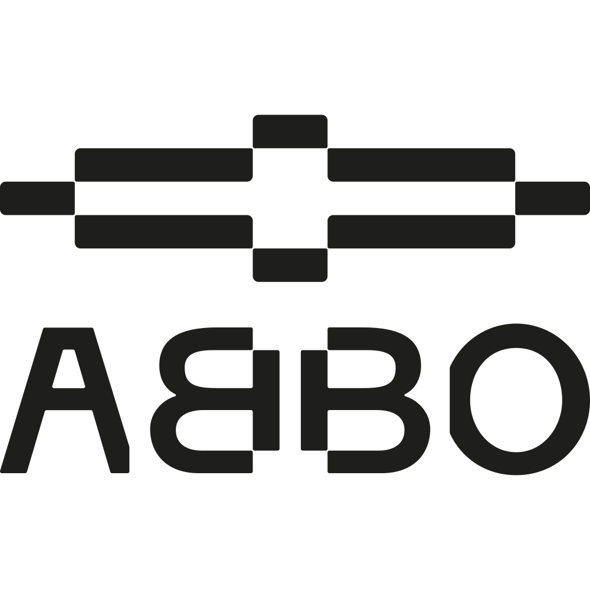

<div align="center">
  

  # ABBO APS
  ### *Diamo sostanza e fondamenta ai progetti per i giovani*

  [](https://reactjs.org/)
  [](https://vitejs.dev/)
  [](https://www.typescriptlang.org/)
  [](https://tailwindcss.com/)
  [](#)
</div>

---

## 🛠 L'Officina Sociale Digitale
**ABBO APS** è un'officina sociale operativa tra Monza, Brianza, Lecco, Bergamo e Milano. 
Il nostro obiettivo è supportare progetti per ragazzi, sviluppare open source nel sociale e rafforzare le reti territoriali. 
Questo repository contiene il codice sorgente del sito web ufficiale dell'associazione, progettato per essere ultra-veloce, accessibile e maniacalmente ottimizzato per i motori di ricerca.

> *"Diamo scheletri di cemento e ferro perché resistano al tempo."*

---

## ✨ Features Principali

- 🚀 **Performance Estreme**: Basato su Vite per un'esperienza SPA fulminea.
- 🔍 **Semantic SEO & JSON-LD**: Architettura SEO customizzata per indicizzazione locale avanzata (Local SEO) e strutturazione microdati (Organization, NewsArticle, DonateAction).
- 🎨 **Design Immersivo**: UI moderna e dinamica gestita tramite TailwindCSS e micro-animazioni fluide con `motion/react`.
- 🤝 **Supporto & Donazioni**: Integrazione nativa per campagne di crowdfunding, recupero materiali e mecenatismo tramite Patreon/PayPal.
- 📱 **100% Responsive**: Esperienza utente perfetta da desktop a mobile.

---

## 💻 Tech Stack

- **Framework**: React 19 + Vite
- **Linguaggio**: TypeScript
- **Styling**: TailwindCSS 4 (Utility-first CSS) + CSS Modules
- **Animazioni**: Motion (Framer Motion)
- **Routing**: React Router DOM (HashRouter)
- **SEO**: React Helmet Async + Generatore JSON-LD Custom

---

## 🚀 Getting Started

Il progetto è pronto per essere eseguito in ambiente locale. Assicurati di avere [Node.js](https://nodejs.org/) (versione 18+) installato.

### 1. Clonare il repository
```bash
git clone https://github.com/ABBOAPS/ABBOAPS-SiteWeb.git
cd ABBOAPS-SiteWeb
```

### 2. Installare le dipendenze
```bash
npm install
```

### 3. Avviare il server di sviluppo
Il server di sviluppo si avvierà in automatico sulla porta 3000 esposta su tutta la rete locale (`0.0.0.0`).
```bash
npm run dev
```

### 4. Build per la Produzione
Per generare la versione statica e ottimizzata per la produzione:
```bash
npm run build
```

---

## 📁 Struttura del Progetto

La codebase è organizzata in modo modulare per facilitare la manutenzione:

```text
src/
├── api/            # Wrapper per integrazioni API esterne (es. Patreon)
├── components/     # Componenti React riutilizzabili (SEO, Topbar, Footer, Animazioni)
├── config/         # File JSON per la configurazione dinamica dei contenuti (Theme, Progetti, ecc.)
├── content/        # Asset documentali e archivi markdown/csv
├── data/           # Dati statici e mock strutturati (News)
├── pages/          # Le singole viste dell'applicazione (Home, Sostienici, Notizie, ecc.)
├── utils/          # Funzioni di utility (Generatore Microdati SEO, formattazione)
├── App.tsx         # Root component e definizione dei Route
└── main.tsx        # Entry point dell'applicazione (Strict Mode, Helmet Provider)
```

---

## 🧱 Supporta il Progetto (Sostienici)

ABBO APS non cerca solo fondi. Cerchiamo **cemento, ferro e mani** per dare sostanza ai progetti dei giovani. Puoi contribuire direttamente dal sito web tramite:
- **Donazione Materiali**: Strumenti hardware e materiali per lo sviluppo di progetti giovanili.
- **Volontariato**: Metti a disposizione il tuo tempo o le tue competenze di coding.
- **Mecenatismo**: Supporto economico tramite Patreon o donazioni singole via PayPal.

Visita la rotta `/sostienici` all'interno dell'app per maggiori dettagli.

---

<div align="center">
  <p>Sviluppato con 🧡 per la community e per i giovani da <strong>ABBO APS</strong>.</p>
</div>
